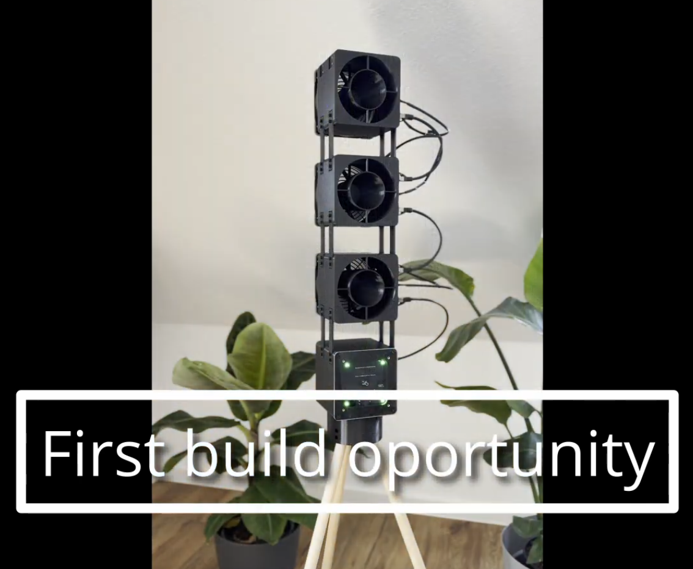
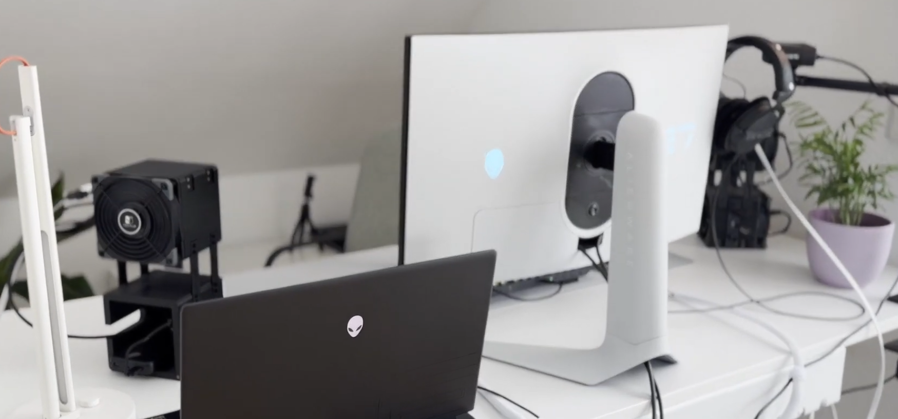

# DIYFAN_V1

Files from the YouTube video:  
**"DIY FAN V1 | Even BETTER than Noctua's desk fan?"**

## Project structure

- **ECAD/** – KiCad files  
- **CODE/** – Arduino code  
- **CAD/** – 3D models (STL, STEP)
- **BOM/** – Each assembly has its own BOM, organized in separate worksheets within a single .ods file (Assembly_Fan-Stage, Assembly_MainPCBA-Housing and Assembly_Tripod)

## License

This project is open source and licensed as follows:

- **ECAD:** CERN Open Hardware License v2.0  
- **CODE:** MIT License  
- **CAD:** Creative Commons Attribution 4.0 (CC BY 4.0)

➡️ For full license texts, see the [LICENSE](LICENSE) file.

## Story

I came up with the idea to develop a modular, battery-powered, open-source fan built around high-end gaming PC fans. Gaming PC fans have low power consumption and, in the best case, are very quiet. Both are qualities that are also useful when the goal is not to cool PC components, but people. Additionally, the goal was to create a visually appealing and functional design.

The result is a system with three main modules: 

**FAN Stage:**

- The shroud slightly increases the wind speed, which allows the device to be placed a bit farther away while still being effective.
- In addition, the interface_V1 PCB is installed on the side. The PC fan can be connected to this board, which then passes on the fan’s signals.

**Main Electronics Module:**

- The electronics module provides approximately 10 W of power. When using fans such as the Noctua NF-A12x25 PWM chromax.black.swap, as I do, up to five fan stages can be operated simultaneously.

**Tripod:**

The goal was to develop, among other things, a modular system. Therefore, the three main components can be assembled in various configurations. Here are the setups shown in the YouTube video:

**Full Build (with 3/5 Fans)**

**Desk Setup**

**Split Mode**

